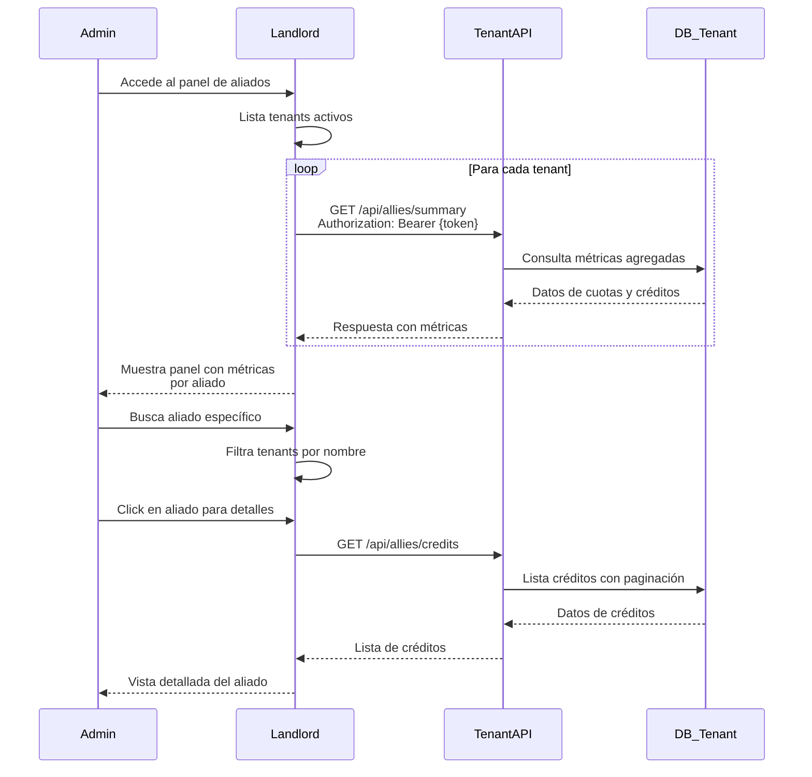

# Plan de Implementación - FASE 1: Gestión de Aliados

## Contexto del Sistema

### Arquitectura Actual
```
Landlord (Puerto 8020)
├── Base de datos central
├── Gestión de clientes (Client)
├── Gestión de créditos (Credit)
├── Transacciones de crédito (CreditTransaction)
└── Panel administrativo Livewire

Tenant-API (Puerto 8021)
├── Multi-tenant con Stancl Tenancy
├── Base de datos por tenant
├── Cuotas de crédito (CreditInstallment)
├── Pagos y amortización
└── Webhooks para sincronización

Frontend (Puerto 5176)
└── Interfaz React para tenants y clientes
```

### Estructura de Datos Actual

#### Landlord
- **Client**: Información del cliente (id, name, email, phone, document, etc.)
- **Credit**: Crédito aprobado (amount, available_amount, status, client_id, etc.)
- **CreditTransaction**: Transacciones del crédito (type: approval, purchase, adjustment; tenant_id, amount)

#### Tenant
- **CreditInstallment**: Cuotas individuales (landlord_credit_id, amount, paid_amount, status, client_id)
- **User**: Usuarios del tenant (admin, operators)

### Flujo de Datos
1. Cliente solicita crédito en tenant → Tenant-API → Landlord API
2. Landlord aprueba → Crea Credit + CreditTransaction → Webhook a Tenant-API
3. Tenant-API crea CreditInstallment para la compra
4. Cliente paga cuotas → Tenant registra pagos en CreditInstallment
5. Landlord consulta métricas → Llama APIs de cada Tenant

### Métricas Requeridas para el Panel
- **Total recolectado en cuotas**: Suma de `paid_amount` de todas las cuotas
- **Total de créditos generados**: Suma de `total_amount` de cuotas parent (installment_number = 0)
- **Buscador de aliados**: Búsqueda de tenants por nombre/identificación

## Estado Actual vs Implementación Propuesta

### ✅ Ya Implementado
- **Estructura multi-tenant**: Stancl Tenancy funcionando
- **Modelos de datos**: Credit, CreditTransaction, CreditInstallment
- **Flujo de aprobación**: Landlord → Webhook → Tenant-API
- **Sistema de pagos**: PaymentService, PaymentController
- **Autenticación**: Sanctum tokens en tenant APIs

### 🚧 A Implementar - FASE 1
- **AlliesController**: Endpoints para métricas por tenant
- **Rutas protegidas**: /api/allies/* con auth:sanctum
- **API tokens**: Sistema de autenticación entre Landlord y Tenants
- **Métricas agregadas**: Consultas optimizadas para dashboard

### 📋 Pendiente - FASE 2
- **Livewire component**: ManageAllies en Landlord
- **Vista administrativa**: Tabla con métricas y buscador
- **Llamadas API**: Http facade para consultar tenants
- **Cache**: Optimización de consultas

## Arquitectura de Endpoints

### 1. Endpoint: GET /api/allies/summary
**Propósito**: Proporcionar métricas agregadas del aliado (tenant)

**Respuesta**:
```json
{
  "success": true,
  "data": {
    "tenant_id": 1,
    "tenant_name": "Tienda ABC",
    "metrics": {
      "total_collected": 1500000.00,
      "total_credits_generated": 2000000.00,
      "active_credits": 15,
      "total_clients": 45,
      "pending_installments": 120,
      "total_pending_amount": 500000.00
    },
    "last_updated": "2026-01-06T16:30:00.000000Z"
  }
}
```

### 2. Endpoint: GET /api/allies/credits
**Propósito**: Lista paginada de créditos activos del aliado

**Parámetros**: `per_page`, `page`

**Respuesta**:
```json
{
  "success": true,
  "data": {
    "credits": [
      {
        "landlord_credit_id": 123,
        "client_id": 456,
        "credit_amount": 500000.00,
        "total_paid": 200000.00,
        "total_remaining": 300000.00,
        "pending_installments": 5,
        "total_installments": 12,
        "progress_percentage": 40.0,
        "status": "active",
        "first_installment_date": "2025-12-01"
      }
    ],
    "pagination": {
      "current_page": 1,
      "per_page": 15,
      "total": 25,
      "last_page": 2
    }
  }
}
```

### 3. Endpoint: GET /api/allies/credits/{landlordCreditId}
**Propósito**: Detalles completos de un crédito específico

**Respuesta**: Información del crédito + lista de cuotas con detalles de pagos

## Estrategia de Autenticación

**Decisión**: No se requiere autenticación entre Landlord y Tenant-API para estos endpoints, ya que son llamadas internas del sistema. Los endpoints `/api/allies/*` estarán disponibles sin `auth:sanctum` para permitir consultas desde Landlord (puerto 8020).

### Consideraciones de Seguridad
- Los endpoints son de solo lectura (GET)
- Comunicación interna entre servicios en localhost
- Rate limiting por IP para prevenir abuso
- Logs de todas las llamadas para auditoría
- En producción: Considerar VPN o red privada para comunicación

### Alternativas Futuras
- API Key compartida si se requiere más seguridad
- Autenticación mutua con certificados para producción
- HMAC signatures para validar integridad

## Diagrama de Flujo



## Implementación Técnica

### Controlador: AlliesController (Ya Creado)
Ubicación: `tenant-api/app/Http/Controllers/Api/AlliesController.php`

#### Método `summary()`
```php
// Métricas agregadas del tenant
$totalCollected = CreditInstallment::sum('paid_amount');
$totalCreditsGenerated = CreditInstallment::where('installment_number', 0)->sum('total_amount');
$activeCredits = CreditInstallment::where('status', '!=', 'pagada')->distinct('landlord_credit_id')->count();
```

#### Método `credits()`
```php
// Lista paginada de créditos agrupados
$credits = CreditInstallment::select(
    'landlord_credit_id',
    DB::raw('COUNT(*) as total_installments'),
    DB::raw('SUM(total_amount) as credit_amount'),
    DB::raw('SUM(paid_amount) as total_paid'),
    DB::raw('SUM(remaining_amount) as total_remaining')
)->groupBy('landlord_credit_id')->paginate(15);
```

#### Método `creditDetails($landlordCreditId)`
```php
// Detalles completos de un crédito
$installments = CreditInstallment::where('landlord_credit_id', $landlordCreditId)->get();
// Cálculos de resumen y transformación para API
```

### Rutas (Ya Agregadas)
Ubicación: `tenant-api/routes/tenant.php`

```php
use App\Http\Controllers\Api\AlliesController;

Route::middleware([
    InitializeTenancyByDomain::class,
    PreventAccessFromCentralDomains::class,
])->prefix('api')->group(function () {

    // ============================================================
    // GESTIÓN DE ALIADOS - MÉTRICAS PARA LANDLORD (SIN AUTENTICACIÓN)
    // ============================================================
    Route::prefix('allies')->group(function () {
        Route::get('/summary', [AlliesController::class, 'summary']);
        Route::get('/credits', [AlliesController::class, 'credits']);
        Route::get('/credits/{landlordCreditId}', [AlliesController::class, 'creditDetails']);
    });

    Route::middleware('auth:sanctum')->group(function () {
        // ... otras rutas protegidas ...
    });
});
```

### Consideraciones de Seguridad
- Rate limiting por IP/tenant
- Validación de permisos (solo landlord puede llamar)
- Logs de acceso para auditoría
- Timeout en llamadas entre sistemas

## Testing y Validación

### Pruebas Unitarias
```bash
# En tenant-api
php artisan test --filter AlliesControllerTest
```

### Pruebas de API con Postman
1. **Obtener token de autenticación**
   ```
   POST /api/login
   Body: {email, password}
   Response: {token}
   ```

2. **Probar endpoint summary**
   ```
   GET /api/allies/summary
   Headers: Authorization: Bearer {token}
   ```

3. **Probar endpoint credits**
   ```
   GET /api/allies/credits?page=1&per_page=10
   Headers: Authorization: Bearer {token}
   ```

### Validación de Datos
- Verificar que las sumas coincidan con datos en BD
- Comparar métricas entre Landlord y Tenant
- Validar consistencia de landlord_credit_id

## Próximos Pasos - FASE 2

### Panel en Landlord (Livewire)
- Componente `AlliesManagement` que liste tenants activos desde BD central
- Para cada tenant: llamada HTTP a `{tenant-domain}/api/allies/summary`
- Buscador por nombre/email/dominio de tenant
- Vista detallada con lista de créditos del aliado
- Gráficos de métricas usando Chart.js o ApexCharts
- Filtros por estado del tenant (active, inactive, suspended)

### Implementación Técnica - FASE 2
```php
// Crear componente Livewire
php artisan make:livewire AlliesManagement

// En AlliesManagement.php
public function loadTenants()
{
    $this->tenants = Tenant::with('domains')->get();
}

public function getTenantMetrics($tenantId)
{
    $tenant = Tenant::find($tenantId);
    $domain = $tenant->domains->first();

    // Llamada HTTP a tenant API
    $response = Http::withToken($tenant->api_token)
        ->get("https://{$domain->domain}/api/allies/summary");

    return $response->json();
}
```

### Optimizaciones
- **Cache**: Implementar Redis para métricas (TTL: 10 minutos)
- **Queue**: Jobs en background para actualizar métricas
- **Rate Limiting**: Limitar llamadas API entre sistemas
- **Fallback**: Mostrar datos cacheados si API falla

### Seguridad Adicional
- Validación de firma HMAC en requests
- Logs de auditoría para llamadas entre sistemas
- Timeouts apropiados en Http client (30 segundos)

## Riesgos y Mitigaciones

1. **Latencia en llamadas API**: Implementar cache y llamadas asíncronas
2. **Falla en tenant API**: Graceful degradation, mostrar datos cacheados
3. **Datos inconsistentes**: Validar integridad, logs de discrepancias
4. **Seguridad**: Rate limiting, validación de tokens, encriptación

## Timeline Estimado

- **Día 1**: Implementar endpoints y pruebas unitarias
- **Día 2**: Configurar autenticación y seguridad
- **Día 3-4**: Implementar panel Livewire básico
- **Día 5**: Optimizaciones y pruebas de integración