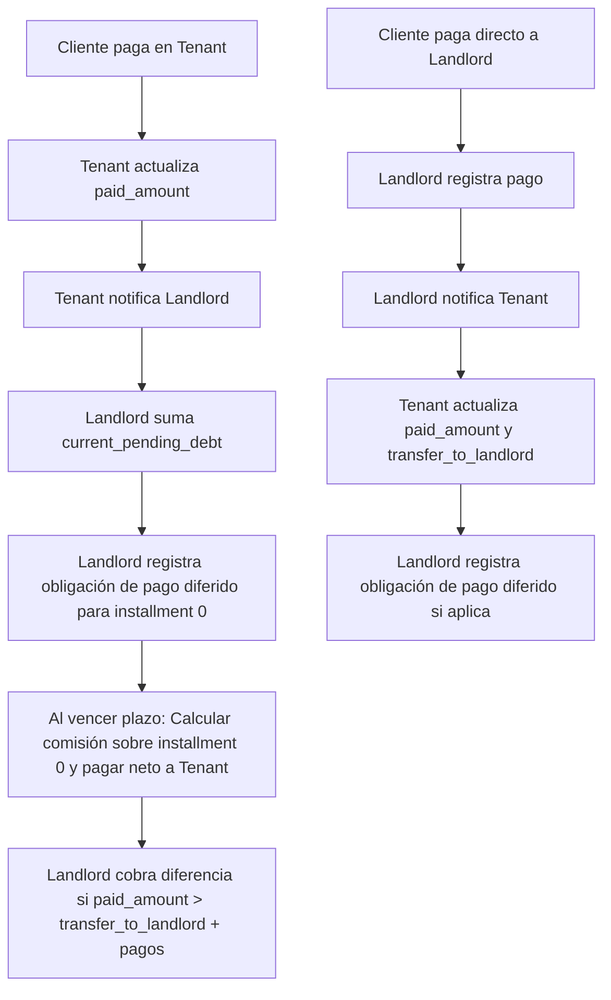

# Plan Actualizado del Módulo de Cobranza para Aliados

## Cambios Incorporados

Según los nuevos requerimientos, el módulo debe contemplar que **landlord también paga a los aliados el monto registrado en el installment 0 que representa la venta**. Cada transacción de venta (installment_number = 0) que genera tenant en landlord es dinero que landlord debe transferir a tenant después del plazo configurado, descontando comisión.

Esto implica un modelo híbrido donde:
- Landlord paga a tenants por las ventas realizadas (basado en installment 0), después de plazo con comisión
- Landlord cobra a tenants por diferencias no transferidas (cobranza tradicional)

## Flujo Actualizado

### Flujo Normal (Cliente paga en Tenant):
1. Cliente paga en tenant → Tenant actualiza `paid_amount` y **notifica a landlord** para sumar en `current_pending_debt`
2. **Landlord registra obligación de pago a tenant** → Según plazo configurado por tenant
3. **Al vencer plazo**: Landlord calcula comisión y paga monto neto a tenant
4. Landlord recibe pago del aliado por diferencia (si aplica) → **Notifica a tenant** para actualizar `transfer_to_landlord`

### Flujo Directo (Cliente paga a Landlord):
1. Cliente paga directamente a landlord
2. Landlord registra el pago y **notifica inmediatamente al tenant** para actualizar `paid_amount` y `transfer_to_landlord`
3. **Landlord registra obligación de pago a tenant** (si no fue pagado antes) → Según plazo configurado
4. No hay acumulación adicional de `current_pending_debt`

## Nuevos Componentes

### Configuración de Tenant para Plazos y Comisiones
- **payment_term_months**: Tenant selecciona plazo en meses (ej: 1, 3, 6, 12)
- **commission_percentage**: Landlord define porcentaje de comisión basado en plazo
  - Ejemplo: 1 mes = 1%, 3 meses = 2%, 6 meses = 3%, 12 meses = 5%
- **Cálculo**: Monto pagado = valor_venta - (valor_venta * commission_percentage / 100)
- **Fecha de pago**: Después del plazo seleccionado por tenant

### Módulo de Pagos a Aliados
- **Propósito**: Gestionar pagos diferidos de landlord a tenants por ventas realizadas
- **Trigger**: Al vencer el plazo configurado por tenant para cada installment 0
- **Monto**: Monto del installment 0 menos comisión calculada
- **Método**: Transferencia bancaria automática o saldo en cuenta tenant

### Tabla Nueva: ally_payments
- `id`: Primary key
- `tenant_id`: String
- `landlord_credit_id`: String
- `transaction_id`: String
- `sale_amount`: BigInt (monto original de la venta)
- `commission_percentage`: Decimal(5,2) (porcentaje aplicado)
- `commission_amount`: BigInt (monto de comisión descontado)
- `amount_paid`: BigInt (monto neto pagado)
- `scheduled_payment_date`: Timestamp (fecha programada según plazo)
- `payment_method`: String (transfer, balance, etc.)
- `payment_date`: Timestamp (fecha real de pago)
- `status`: Enum (scheduled, completed, failed)
- Timestamps

### Lógica de Negocio Actualizada
- **Pago diferido**: Al registrar installment 0 (venta), landlord programa pago para fecha futura según plazo tenant
- **Cálculo de comisión**: Al vencer plazo, calcular comisión sobre monto del installment 0 y pagar neto
- **Cobranza diferencial**: Si paid_amount > transfer_to_landlord + amount_paid, cobrar diferencia
- **Balance tenant**: Mantener saldo disponible para tenants

## Diagrama de Flujo



## Endpoints y Webhooks para Pagos a Aliados

### Endpoints en Landlord API

#### 1. POST /api/ally-payments
- **Propósito**: Registrar pago a tenant por venta
- **Request**:
  ```json
  {
    "tenant_id": "EMPRESA1",
    "landlord_credit_id": "CRD-001",
    "transaction_id": "TXN-001",
    "amount": 150000,
    "payment_method": "bank_transfer"
  }
  ```
- **Response**: 201 Created con payment_id

#### 2. GET /api/ally-payments/{tenant_id}
- **Propósito**: Listar pagos realizados a un tenant
- **Response**: Array de pagos con status y fechas

### Webhooks

#### 1. POST /webhooks/ally-payment-completed (Landlord → Tenant)
- **Payload**:
  ```json
  {
    "event": "ally.payment.completed",
    "data": {
      "tenant_id": "EMPRESA1",
      "payment_id": "PAY-001",
      "amount": 150000,
      "transaction_id": "TXN-001"
    }
  }
  ```

#### 2. POST /webhooks/sale-generated (Tenant → Landlord)
- **Propósito**: Notificar nueva venta para trigger pago automático
- **Payload**:
  ```json
  {
    "event": "sale.generated",
    "data": {
      "tenant_id": "EMPRESA1",
      "landlord_credit_id": "CRD-001",
      "amount": 150000,
      "transaction_id": "TXN-001"
    }
  }
  ```

## Cambios en Base de Datos

### Nueva Tabla: ally_payments
```sql
CREATE TABLE ally_payments (
    id BIGINT PRIMARY KEY AUTO_INCREMENT,
    tenant_id VARCHAR(255) NOT NULL,
    landlord_credit_id VARCHAR(255) NOT NULL,
    transaction_id VARCHAR(255) NOT NULL,
    sale_amount BIGINT NOT NULL,
    commission_percentage DECIMAL(5,2) NOT NULL DEFAULT 0.00,
    commission_amount BIGINT NOT NULL DEFAULT 0,
    amount_paid BIGINT NOT NULL,
    scheduled_payment_date TIMESTAMP NOT NULL,
    payment_method VARCHAR(50),
    payment_date TIMESTAMP NULL,
    status ENUM('scheduled', 'completed', 'failed') DEFAULT 'scheduled',
    created_at TIMESTAMP DEFAULT CURRENT_TIMESTAMP,
    updated_at TIMESTAMP DEFAULT CURRENT_TIMESTAMP ON UPDATE CURRENT_TIMESTAMP,
    INDEX idx_tenant (tenant_id),
    INDEX idx_transaction (transaction_id),
    INDEX idx_scheduled_date (scheduled_payment_date),
    INDEX idx_status (status)
);
```

### Modificación a ally_collection_configs
- Agregar campo `total_paid_to_ally`: BIGINT DEFAULT 0 (acumulado de pagos realizados)
- Agregar campo `payment_term_months`: INT DEFAULT 1 (plazo en meses para pago de ventas)
- Agregar campo `commission_percentage`: DECIMAL(5,2) DEFAULT 0.00 (porcentaje de comisión basado en plazo)

## Próximos Pasos
1. Implementar endpoints de pagos en Landlord API
2. Crear webhooks para notificaciones de pagos
3. Actualizar lógica de negocio para pagos automáticos
4. Modificar componente Livewire para mostrar historial de pagos
5. Testing end-to-end del flujo híbrido
6. Documentar API completa